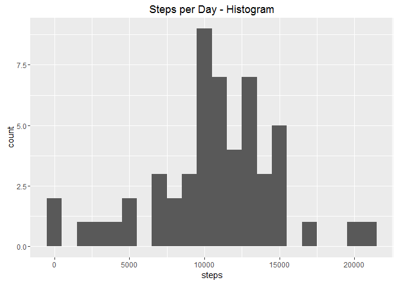
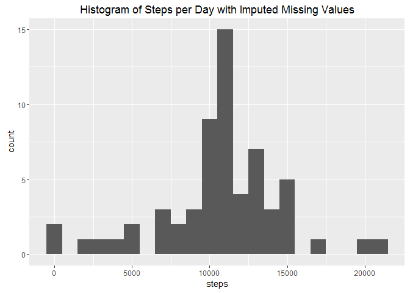

# Reproducible Research: Peer Assessment 1


# Coursera Project 1 - Reproducible Research  
  
## Introduction  
  
This assignment makes use of data from a personal activity monitoring device. This device collects data at 5 minute intervals throughout the day. The data consists of two months of data from an anonymous individual collected during the months of October and November, 2012 and include the number of steps taken in 5 minute intervals each day.

**Preparing R for the Markdown document** 
  
Set the echo option of code chunk to be true for the document in order to display code as well as output.


```r
library(knitr)
opts_chunk$set(echo = TRUE)
```

**Loading the necessary packages.**


```r
library(dplyr)
```

```
## 
## Attaching package: 'dplyr'
```

```
## The following objects are masked from 'package:stats':
## 
##     filter, lag
```

```
## The following objects are masked from 'package:base':
## 
##     intersect, setdiff, setequal, union
```

```r
library(ggplot2)
library(lubridate)
```

```
## 
## Attaching package: 'lubridate'
```

```
## The following object is masked from 'package:base':
## 
##     date
```

## Loading and preprocessing the data  
  
**1. Load data** 
  
Setting wd.


```r
setwd("C:/Users/Hussain/Documents/GitHub/ReproducibleResearch/RepData_PeerAssessment1")
```

Unzip file.


```r
if(!file.exists("activity.csv")) {
        unzip("activity.zip")
}
```

Read data.


```r
if(!exists("activityData")) {
        activityData <- read.csv("activity.csv", header = TRUE)
}
```

**2. Process data** 
  
Change the format of date column to date format.  
  

```r
activityData$date <- ymd(activityData$date)
```

## What is mean total number of steps taken per day?  
  
**1. Total number of steps per day** 


```r
steps <- activityData %>%
        filter(!is.na(steps)) %>%
        group_by(date) %>%
        summarise(steps = sum(steps)) %>%
        print
```

```
## # A tibble: 53 x 2
##          date steps
##        <date> <int>
## 1  2012-10-02   126
## 2  2012-10-03 11352
## 3  2012-10-04 12116
## 4  2012-10-05 13294
## 5  2012-10-06 15420
## 6  2012-10-07 11015
## 7  2012-10-09 12811
## 8  2012-10-10  9900
## 9  2012-10-11 10304
## 10 2012-10-12 17382
## # ... with 43 more rows
```

**2. Histogram of the total number of steps taken each day** 


```r
ggplot(steps, aes(x = steps)) +
        geom_histogram(binwidth = 1000) +
        labs(title = "Steps per Day - Histogram", xlab = "Steps per Day", ylab = "Frequency")
```

<!-- -->

**3. Mean and Median of total number of steps taken per day** 
  
Mean.


```r
stepsMean <- mean(steps$steps, na.rm = TRUE)
stepsMean
```

```
## [1] 10766.19
```

Median.  
  

```r
stepsMedian <- median(steps$steps, na.rm = TRUE)
stepsMedian
```

```
## [1] 10765
```

## What is the average daily activity pattern?  
  
**1. The average number of steps taken in each 5-minute interval per day**   
  
Calculate average steps for each 5-minute interval per day.  


```r
intervalAvgSteps <- activityData %>%
        filter(!is.na(steps)) %>%
        group_by(interval) %>%
        summarize(steps = mean(steps))
```

Time series of the 5-minute interval and average steps taken.  


```r
ggplot(intervalAvgSteps, aes(x = interval, y = steps)) +
        geom_line()
```

<!-- -->

**2. Maximum steps on average across all the days** 
  
Compute the maximum of the daily average.  


```r
intervalAvgSteps[which.max(intervalAvgSteps$steps), ]
```

```
## # A tibble: 1 x 2
##   interval    steps
##      <int>    <dbl>
## 1      835 206.1698
```

The interval `835` has, on average, the highest count of steps, with 206 steps.  
  
## Imputing missing values  
  
**1. Summarise all the missing values** 


```r
sum(is.na(activityData$steps))
```

```
## [1] 2304
```

Total missing values are 2304.  
  
**2. Impute missing values with the average number of steps in the same 5-min interval.**   
  
**3. Create a copy of the original data.** 


```r
activityDataFill <- activityData
```

Loop through the missing values to fill them with average steps per 5-minute interval.  


```r
naData <- is.na(activityDataFill$steps)

intervalAvg <- tapply(activityDataFill$steps, activityDataFill$interval, mean, na.rm = TRUE, simplify = TRUE)

activityDataFill$steps[naData] <- intervalAvg[as.character(activityDataFill$interval[naData])] 
```

Check to verify if the missing values have been replaced.  


```r
sum(is.na(activityDataFill$steps))
```

```
## [1] 0
```

**4. Calculate the number of steps in each 5-minute interval per day**


```r
stepsFilled <- activityDataFill %>%
        filter(!is.na(steps)) %>%
        group_by(date) %>%
        summarize(steps = sum(steps)) %>%
        print
```

```
## # A tibble: 61 x 2
##          date    steps
##        <date>    <dbl>
## 1  2012-10-01 10766.19
## 2  2012-10-02   126.00
## 3  2012-10-03 11352.00
## 4  2012-10-04 12116.00
## 5  2012-10-05 13294.00
## 6  2012-10-06 15420.00
## 7  2012-10-07 11015.00
## 8  2012-10-08 10766.19
## 9  2012-10-09 12811.00
## 10 2012-10-10  9900.00
## # ... with 51 more rows
```

Plot the total steps per day in histogram.  


```r
ggplot(stepsFilled, aes(x = steps)) +
        geom_histogram(binwidth = 1000) +
        labs(title = "Histogram of Steps per Day with Imputed Missing Values", xlab = "Steps per Day", ylab = "Frequency")
```

<!-- -->

Mean steps post imputing missing values.  


```r
stepsMeanFilled <- mean(stepsFilled$steps, na.rm = TRUE)
stepsMeanFilled
```

```
## [1] 10766.19
```

Median steps post imputing missing values.  


```r
stepsMedianFilled <- median(stepsFilled$steps, na.rm = TRUE)
stepsMedianFilled
```

```
## [1] 10766.19
```

There is no impact in imputing missing values in the data with the average number of steps in the same 5-minute interval. Both mean and median are equal to the earlier results.  
  
## Are there differences in activity patterns between weekdays and weekends?  
  
**1. Define a new factor variable in the dataset with two levels of "weekday" and "weekend" indicating whether a given date is a weekday or a weekend respectively.** 


```r
activityDataFill <- mutate(activityDataFill, weektype = ifelse(weekdays(activityDataFill$date) == "Saturday" | weekdays(activityDataFill$date) == "Sunday", "weekend", "weekday"))

activityDataFill$weektype <- as.factor(activityDataFill$weektype)

head(activityDataFill)
```

```
##       steps       date interval weektype
## 1 1.7169811 2012-10-01        0  weekday
## 2 0.3396226 2012-10-01        5  weekday
## 3 0.1320755 2012-10-01       10  weekday
## 4 0.1509434 2012-10-01       15  weekday
## 5 0.0754717 2012-10-01       20  weekday
## 6 2.0943396 2012-10-01       25  weekday
```

**2. Panel plot containing a time series plot of the 5-minute interval and the average number of steps taken, averaged across all weekday days or weekend days.**   
  
Summarise by weektype.  


```r
intervalFilled <- activityDataFill %>%
        group_by(interval, weektype) %>%
        summarise(steps = mean(steps))
```

Panel plot time series of each weektype.  


```r
stepsWeektpye <- ggplot(intervalFilled, aes(x = interval, y = steps, color = weektype))
stepsWeektpye + 
        geom_line() +
        facet_wrap(~weektype, ncol = 1, nrow = 2)
```

<!-- -->
  
From the two plots it seems that the test person is more active earlier in the day during the weekdays compared to the weekends; but appears to be more active during the weekends in general compared to the weekdays.  
  
  
